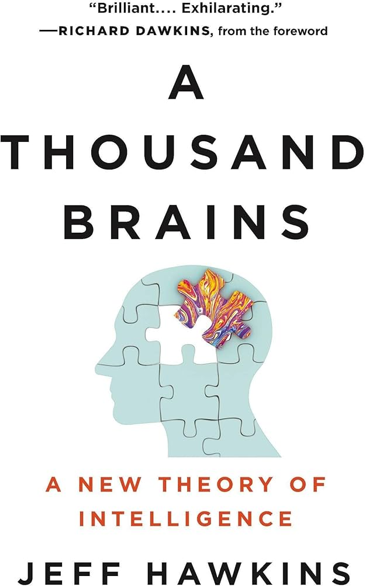

## About the Book

*A Thousand Brains: A New Theory of Intelligence* by Jeff Hawkins proposes a new framework for understanding how the neocortex works, and what that means for building truly intelligent machines. Each Brainies session covers a chunk of the book, followed by group discussion.

<!-- Add your book cover image to this folder, named book-cover.jpg -->

---

## Sessions

### Session 1
**Status:** Presented
<!-- No slides available for this session yet -->

### Session 2
**Status:** Presented
<!-- Add your session 2 slide file to this folder and name it talk-2-slides.pdf
     (or .pptx — just update the filename above to match) -->

### Session 3
**Status:** Presented

[View Slides](talk-3-slides.pdf)
<!-- Add your session 3 slide file to this folder and name it talk-3-slides.pdf -->

### Session 4 onward
**Status:** Upcoming — will be recorded
<!-- Once you have recordings, add an entry per session, e.g.:
### Session 4

-->

---

## Meeting Photos

<!--
Drop your meeting photos into this same folder (e.g. session-1.jpg, session-2.jpg, session-3.jpg)
and reference them below. Add a new line each time you have a new photo.
-->

